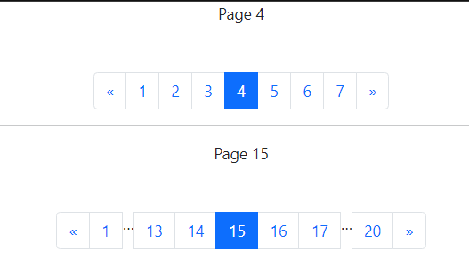

# Simple jQuery pagination plugin for Bootstrap 5+



### Basic usage ###

Plugin requires jQuery (required - 1.7.0 or higher).


Add the following to your HTML file:

```javascript
    <ul id="mypagination" class="pagination"></ul>
```


Add the following to your js file:


```javascript

    $('#mypagination1').pagination({
        items: 20,              // Total Pages
        displayedPages: 7,      // Paginated Pages Shown
        currentPage: 1,
        edges: 0,               // If > 1, Will add (...)
        cssStyle: '',
        prevText: '<span aria-hidden="true">&laquo;</span>',
        nextText: '<span aria-hidden="true">&raquo;</span>',
        onInit: function () {
            // fire first page loading
        },
        onPageClick: function (page, evt) {
            //your Ajax call comes here with page parameter
        }
    });
```


## Demo 
For more information [Check Demo Pagination here](https://sjqpagination.netlify.app) 
